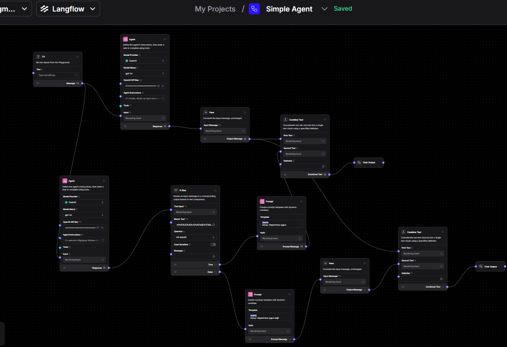

# 🤖 CV Analiz ve Mülakat Asistanı

Bu proje, bilgisayar mühendisliği alanında işe alım sürecini dijitalleştirerek insan kaynakları (İK) uzmanlarının iş yükünü azaltmayı hedefleyen bir yapay zeka destekli asistan sistemidir.

## 📌 Proje Amacı

Adayların **özgeçmişlerini (CV)** analiz ederek pozisyona uygunluklarını değerlendiren, ardından **otomatik mülakat soruları** üreten bir yapay zeka tabanlı asistan geliştirilmiştir.

## 🛠️ Kullanılan Teknolojiler

- **Langflow:** Görsel tabanlı LLM akışlarını oluşturma aracı. GPT API ile etkileşimli senaryolar kurgulanmıştır.
- **LLM (GPT API):** CV analizi ve mülakat sorularının üretiminde doğal dil işleme (NLP) motoru olarak kullanılmıştır.
- **ASP.NET Web API:** Kullanıcı arayüzü ile sistem arasındaki veri alışverişi bu servisler aracılığıyla gerçekleştirilmiştir.

## 🔁 Uygulama İşleyişi

1. İK personeli, adayın CV'sini sisteme yükler.
2. Sistem CV'yi analiz eder, pozisyona uygunluk skorunu ve özetini üretir.
3. GPT tabanlı model, pozisyona özel **5 mülakat sorusu** oluşturur.
4. Analiz ve öneriler, web arayüzü üzerinden İK uzmanına sunulur.

## 🖼️ Proje Akışı (Langflow Görseli)

Aşağıda, Langflow arayüzünde oluşturulan akış yapısı gösterilmektedir:

> Görselde: CV'den alınan bilgilerle GPT modeli entegre edilerek nasıl mülakat soruları oluşturulduğu gösterilmektedir.

